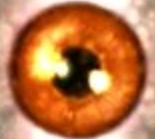
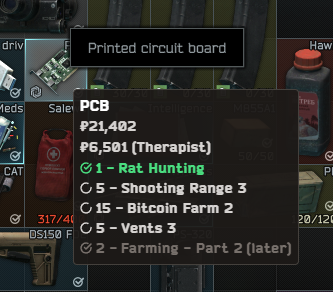
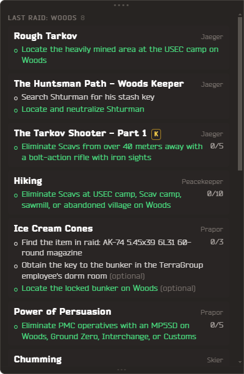
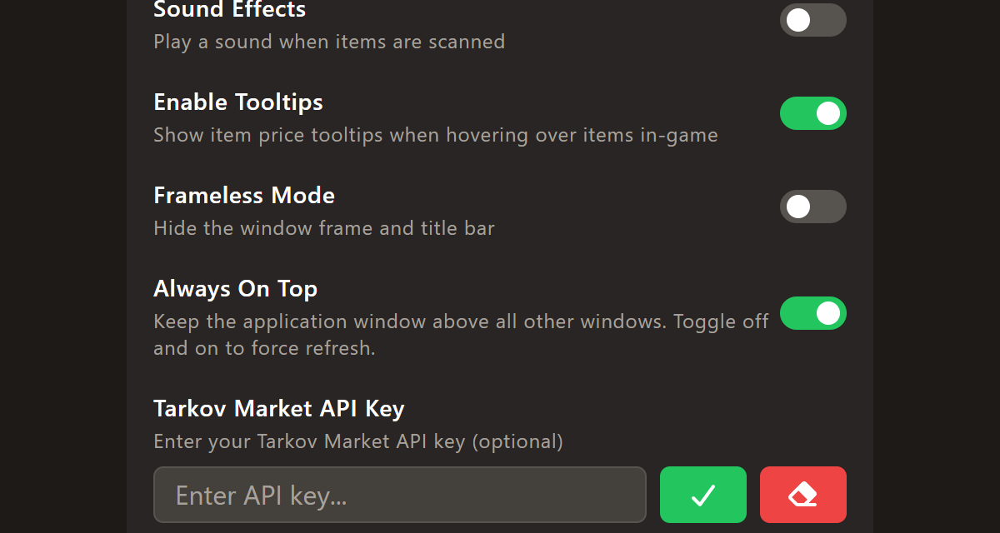
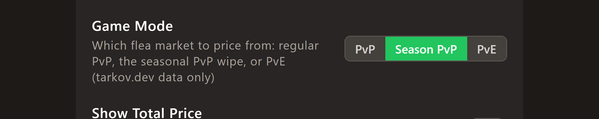
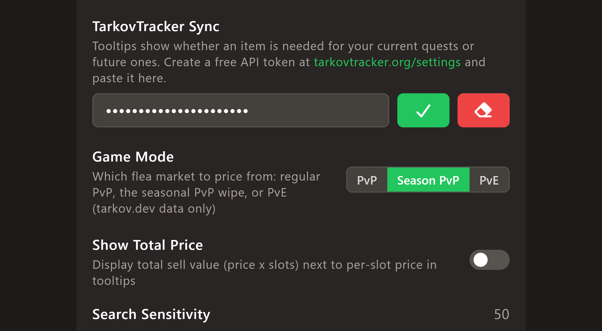

<div align="center">



# ORBB ToolTip

**Hover an item in Escape from Tarkov. See what it's worth and whether you need it. Press a key and your quests, progress and map are right there. No alt-tabbing.**



<sub>Green = needed for a quest you can do <b>now</b> (✓ = must be found in raid) · white = hideout upgrades · grey "(later)" = locked behind other quests</sub>

</div>

---

## What it does

**Item tooltips.** Hover any item in your stash, a trader, the flea market or a raid and a small dark box appears next to the game's own tooltip with:

- **What the whole item sells for** — flea market average and the best trader offer (per-slot value shown small for anything bigger than 1×1)
- **Quests and hideout upgrades that need it**, with counts
- **Your progress** *(optional)* — link TarkovTracker and requirements you can do **right now show green**, ones locked behind later quests are dimmed "(later)", and ones you've already finished disappear

**Quest panel.** Press **`'`** and a Questie-style panel slides in from the right: the quests you've accepted with objectives on the map you're on, and the ones you can do anywhere. Objectives still to do are listed white with their counters ("3/5"); a quest whose work is all done but that you haven't handed in yet collapses to a green title with a **DONE** badge, and **READY** appears when the game itself says so.

- **Click** a quest to collapse it, **press and drag** it to reorder the list, **middle-click** it to open its wiki page — your order and which quests are collapsed are remembered between sessions.
- **✓ DONE** in the section header shows the finished objectives too, dimmed and still in the order the game lists them, so you can see what you've already knocked out. The section header (the map name, or ANYWHERE) sticks to the top as you scroll and carries the toggle with it.
- **Daily and weekly tasks sit in the same lists**, on their own map or under Anywhere, with their steps and a live countdown to when they rotate out. No catalog knows them, so everything shown is read off your screen — scan a trader's task list or the OPERATIONAL tab to pick them up.
- Click the map name to browse any map's quests, drag the top grip to move the panel, the bottom-left corner to resize it, and the slider (top-right) to set opacity.
- **Ctrl + wheel scrolls it from anywhere**, even mid-raid while the game owns your cursor; in menus just hover it and scroll normally.
- Under the list, **what changed lately** — each line marked by where it came from: ◎ read off the Tasks screen, ● from the game's log, ▸ from an in-raid notification, ↺ from TarkovTracker.

<div align="center"></div>

**Map window.** The **Map** button (or **`[`**) opens a floating, zoomable map of where you are — wheel to zoom, drag to pan, double-click to fit, move and resize it as you like, and it shares the panel's opacity and opens and closes with it. Maps are plain images you drop in the app's `resources\maps` folder ([maps/README.md](maps/README.md) lists the file names it looks for); Customs, Factory, Woods, Shoreline and Interchange are included.

**Where your progress comes from** — three layers, merged:

1. **The game's own logs.** The same files TarkovMonitor reads. They say which quests you've accepted, handed in or failed, which map you loaded into and when the raid ended. Instant and exact.
2. **The Tasks screen scanner.** Press **`]`** (or click **SCANNER** at the top of the panel) on the game's Tasks screen or a trader's task list and the overlay reads it: which tasks are active, their percent, the time left on a daily, and — for the task you have open — each objective's counter and whether it carries the game's ✓. Scroll and click through your tasks; it keeps reading until you turn it off or leave the screen.
3. **In-raid notifications.** The "Subtask completed" / "Task … is ready to be completed" toasts in the bottom-right corner are read as they appear.

4. **TarkovTracker itself.** Out of raid it's polled every few minutes and whenever you open the panel, so anything TarkovMonitor (or you, on another device) marked there shows up here.

Everything learned is kept locally, and whatever your tracker can hold — objective counters and completions, hand-ins, failures — is **pushed to TarkovTracker** too, so it stays the one source of truth across devices. Nothing is ever marked *un*-done from a misread. The rest stays here: a task's overall percent and your daily tasks have nowhere to go on the tracker, so the overlay keeps them itself.

**Search log.** The main window lists everything you've hovered, newest first, with its market and trader value and a running **market total** and **trader total** — handy for deciding what's worth dragging out of a raid.

Prices come from [tarkov.dev](https://tarkov.dev) (community data, refreshed every 15 minutes) for **regular PvP, the seasonal PvP wipe, or PvE** — your pick. The flea number is the **24-hour average**, so on a volatile item it will sit below the cheapest offer on screen when the market is running hot and above it when it's cold — that's the average doing its job, not a stale read. It only ever *reads pixels from your screen and your own log files*; it never touches the game, sends it input, or modifies anything.

> ORBB ToolTip is a fork of [sammereye/flea-tooltip](https://github.com/sammereye/flea-tooltip) (FleaTooltip), revived after its price source went offline in July 2026 and extended from there. As with any overlay, use it at your own discretion regarding BSG's terms of service.

---

## Setup in five minutes

### 1. Get the app

Download the latest build from the [Releases](https://github.com/Magicard/orbb-tooltip/releases) page and unzip it anywhere, or [build it yourself](#building-from-source). Run `ORBBToolTip.exe`.

> **Requirements:** Windows 10/11 and the [Microsoft Visual C++ Redistributable x64](https://learn.microsoft.com/en-us/cpp/windows/latest-supported-vc-redist) (you almost certainly already have it).

### 2. Set Tarkov to Borderless

In Tarkov's graphics settings set **Screen mode → Borderless**. Overlays can't draw on top of exclusive fullscreen — this is the number one reason for "nothing shows up". If you have several monitors, keep the game on your **primary** one.

### 3. Turn on the overlay

Click the ⚙ in the top-right of the ORBB window and switch on **Enable Tooltips** and **Always On Top**.



### 4. Pick your game mode

Further down, choose the flea market you actually play on — **PvP**, **Season PvP** or **PvE**. Prices differ a lot between them.



### 5. Calibrate once

The scanner needs to learn where Tarkov draws its item tooltip on your resolution.

1. In Tarkov, open your **stash** and hover an item so the game's own little name-tooltip is showing.
2. Press **F6** (or the ◎ button next to the gear). The ORBB window says *"Screen Configuration Started"*.
3. With the mouse still on that item (tooltip visible), press **F6 again** — then **don't move the mouse** while it scans.
4. When it says *"Configuration Complete"*, restart ORBB ToolTip.

That's it. Hover things and prices appear.

---

## Quest tracking with TarkovTracker *(optional, recommended)*

Without a TarkovTracker token the app already knows what you've accepted and handed in from the game's logs. Linking the tracker adds per-objective progress, level and faction, keeps several devices in sync, and lets ORBB push what it learns back.

### Create a token

1. Sign in at [tarkovtracker.org](https://tarkovtracker.org) (free).
2. Open **Settings → API Tokens**, give it a name, tick **Get Progression** *and* **Write Progression** (so ORBB can push hand-ins and scanned progress; leave the second one off if you'd rather it didn't), create it and copy it.
3. On the same page make sure your tracker is on the same **game mode** as the app — season, PvP and PvE have separate progress there.

### Paste it into ORBB ToolTip

⚙ → **TarkovTracker Sync** → paste → ✓. The header of the main window shows the tracker's display name, level and faction once it's connected.



### Keep it in sync automatically with TarkovMonitor

[TarkovMonitor](https://github.com/the-hideout/TarkovMonitor) watches Tarkov's log files and marks quests complete on TarkovTracker the moment you hand them in. Install it, paste the same token into its settings, leave it running next to the game. ORBB reads the same logs itself, so the overlay is live either way; TarkovMonitor keeps the tracker up to date for everything else (hideout, level).

### Exact progress: scan the Tasks screen

Leave the quest panel open while you scan — it's a thin strip at the right edge, clear of the task list, and it shows the progress. The map window is put away automatically for the duration and comes back after: ORBB masks its own windows out of the scan, so anything sitting on top of the game would be a hole in what the scanner can read.

Counters like "3/5" and ticks inside a quest aren't in the logs — they're read off the screen. Open the game's **Tasks** screen (or a trader's task list), press **`]`** or click **SCANNER** at the top of the panel, and the status line turns amber: *"Reading the Tasks screen…"*. Scroll through your list and click the quests you care about; each one you open is read within a second or two. Click SCANNER again (or just leave the screen) to stop.

---

## Hotkeys

| Key | What it does |
| --- | --- |
| **F1** | Show / hide the ORBB window |
| **F2** | Remove the lowest-value item from the search log |
| **F3** | Remove the last scanned item |
| **F4** | Add one to the last scanned item's count |
| **F6** | Screen calibration |
| **`'`** | Slide the quest panel in / out (changeable in settings) |
| **Ctrl + `'`** | Put the overlays back in order if hover or Ctrl+wheel stops responding |
| **`[`** | Show / hide the map window (changeable) |
| **`]`** | Start / stop reading the game's Tasks screen (changeable) |
| **Ctrl + wheel** | Scroll the quest panel from anywhere while it's open |
| **Middle-click a quest** | Open its page on the wiki |
| **Press and drag a quest** | Reorder the list (remembered) |
| **F12** | Developer tools |

Each hotkey can be switched off in settings if it clashes with something.

---

## Troubleshooting

**Nothing appears when I hover.**
Borderless mode (step 2), tooltips enabled (step 3), calibration done (step 5) — in that order. Hover long enough for the *game's* tooltip to fully appear; that's what gets read.

**Some items scan, some don't.**
The scanner finds the game's tooltip by its border colour. If BSG changes the UI, adjust the RGB border colour in settings (defaults: 82 / 89 / 90). Unmatched reads are written to the log file — find it via `%APPDATA%\tarkov-price-tooltip\logs\main.log` and open an issue with the line.

**The panel says a quest is on a map it isn't, or lists one I don't have.**
The panel shows what the game's logs say you've accepted. If you've never played with logging on this PC, scan the Tasks screen once and the active list fills in from that instead. A row the scanner can't match to any known quest is treated as a daily and only kept when the game laid it out as a real task row — a location, a status and a progress bar, or a countdown; anything looser has to be read the same way twice. If junk ever does get through, a later scan of the same screen replaces it.

**A daily shows no steps, no percent or no timer.**
Only what is on the screen can be read. The list view gives a daily its name, map and countdown; its steps only exist once you click it and its Objective(s) section is showing. Scan again with the task open.

**A finished objective stays white.**
Open the quest on the Tasks screen with the scanner on so it can see the ✓. The tick is detected by colour; if your game uses an unusual UI colour scheme, tell us.

**"Token rejected".**
Make sure the token came from **tarkovtracker.org** (not the old tarkovtracker.io — those still work, but the site is legacy), was copied with the copy button, and has *Get progression* permission. Pushing progress additionally needs *Write progression*; without it the app logs one warning and keeps working read-only.

**"Fetching Items from Database Failed".**
tarkov.dev is temporarily unreachable. The app retries every minute on its own; nothing to do.

**Numbers look stuck or a quest shows the wrong percent.**
Older builds could read ORBB's own panel back off the screen and keep re-confirming whatever it already believed. That's fixed — the app masks its own windows before scanning — and the first run after updating throws the old readings away. Scan once more and the game's real numbers land.

**Hover or Ctrl + wheel stopped working mid-session.**
The panel and map become clickable the moment your cursor is over them (the app checks the cursor position ten times a second rather than trusting window hover events, which Windows delivers unreliably to click-through overlays), and Ctrl + wheel heals itself within seconds if Windows drops the hook behind it. In a raid the game owns the cursor, so the overlays are never clickable there.

---

## Is it heavy?

No. Measured while the game runs: about **2% of one CPU core** in a raid and ~500 MB of RAM (Electron's floor). The scanner polls your cursor every 25 ms and backs off to 100 ms when nothing's happening, the log watcher checks one file's size every 2 seconds, the toast reader strips the corner of the screen down to bright pixels and skips OCR entirely when there's nothing there, and the panel and map windows don't exist on screen until you open them. The Tasks-screen scanner is the one thing that costs real CPU — about a core while the screen is changing — and it only runs while you've turned it on, skipping the OCR completely while the screen stays the same.

---

## How it works

1. A small native helper (`ocr_cpp.exe`, Tesseract OCR) watches the screen around your cursor for the game's tooltip border and reads the item name. It also hosts the Ctrl + wheel hook and the screen reads below.
2. The Electron main process matches that name against a fuzzy index of all ~5,300 items and looks up prices, quest and hideout requirements (from `json.tarkov.dev`) and your TarkovTracker progress.
3. A transparent always-on-top window draws the tooltip beside your cursor; two more draw the quest panel and the map.

**The Tasks-screen scanner** OCRs the whole screen — with ORBB's own windows blacked out first, so it can never read its own output back — and rebuilds the game's rows from word positions. One line of pixels is not one row of the UI: a trader's page draws their task list down the left and the open task down the right, so a line crosses both, and a row of the Tasks screen is tall enough that its name, its status and a daily's countdown each land on a different line. So the words are reshaped first — panes split apart after a status word, the countdown lifted out of the row it belongs to, and the stacked cells put back together, using the game's own column header to tell how wide one row is.

From there it picks out task rows (name · map · status · percent, or just name · status on a trader's list) and the open task's objective rows — the text, "3/5" counters, the tick-coloured pixels after the text, and whether the game painted that row's band the "done" blue (the sturdier of the two signals). Names are matched to the quest catalog tolerating the stray letters OCR makes of the icons. A task's steps are taken only from between the game's own Objective(s) and Rewards headings, so a trader's chatter never ends up in the list, and a daily takes its trader from the identified tasks around it — both of the game's lists are grouped by trader, which is the same thing its portrait column is telling you.

Only what's on screen can be read, so scroll and click through.

**Progress flow:** game logs → accepted / handed in / failed; Tasks screen → counters, ticks, percent, daily timers; in-raid toasts → subtask done / ready to hand in. All of it is merged in the panel and, if enabled, pushed to TarkovTracker as completions and counters only — a completion needs the tick in two separate reads, a counter has to beat what the tracker already holds, and nothing is ever marked *un*-done, so a missed read cannot undo real progress. Writes are batched to the end of a scan rather than sent per pass, because the tracker has a daily write quota.

---

## Building from source

Requires Node.js 18+ on Windows.

```
npm install
npm start          # run in development
npm run package    # build out/ORBBToolTip-win32-x64/
npm run make       # build the release zip and installer into out/make/
```

Press F6 in-app afterwards to calibrate (repackaging resets the calibration file).

### Rebuilding the OCR scanner (optional)

`lib/ocr/ocr_cpp.exe` is prebuilt. To change it (`lib/ocr_cpp/ocr_cpp.cpp`) you need Visual Studio 2022 Build Tools with the C++ workload and [vcpkg](https://github.com/microsoft/vcpkg) with `tesseract:x64-windows` installed and `vcpkg integrate install` run. Then:

```
msbuild lib\ocr_cpp\ocr_cpp.vcxproj /p:Configuration=Release /p:Platform=x64 /p:PlatformToolset=v143
```

The build drops the exe and its runtime DLLs into `lib/ocr/`.

---

## Credits & licenses

Original app by [sammereye](https://github.com/sammereye/flea-tooltip). Item, price, quest and hideout data by the [tarkov.dev](https://tarkov.dev) project; progress tracking by [TarkovTracker](https://tarkovtracker.org) and [TarkovMonitor](https://github.com/the-hideout/TarkovMonitor); quest pages by the [Escape from Tarkov Wiki](https://escapefromtarkov.fandom.com). OCR by [Tesseract](https://github.com/tesseract-ocr/tesseract). Bundled third-party libraries are listed in [THIRD_PARTY_NOTICES.md](THIRD_PARTY_NOTICES.md). MIT licensed.

Escape from Tarkov is a trademark of Battlestate Games. This is an unofficial fan project, not affiliated with or endorsed by BSG.
